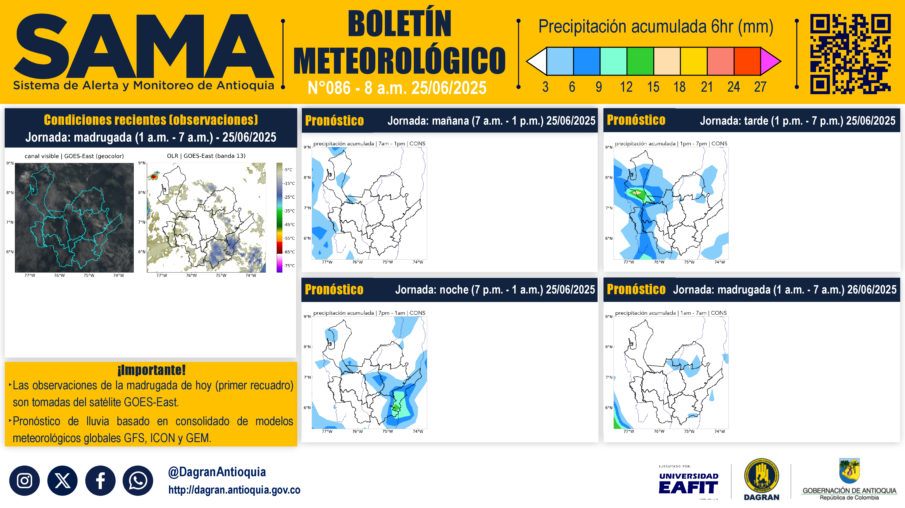

# BoletinDiario_light
Paquete de códigos necesarios para producir el boletín diario descargando las gráficas de Google Drive.


## Requisitos

### Python

**Versión recomendada**: Python 3.9
Se recomienda crear un entorno virtual para instalar las dependencias del proyecto. Puede hacerlo utilizando Anaconda:

### Anaconda
Si usa Anaconda, puede crear y activar un entorno virtual con los siguientes comandos:

```bash
conda create --name {env_name} python=3.9
conda activate {env_name}
```

> **Nota:** Recuerde cambiar el nombre del env_name por el que usted decida

### Instalación de Dependencias
Asegúrese de tener `pip` instalado y ejecute el siguiente comando para instalar las dependencias necesarias:

```bash
pip install -r requirements.txt
```

Esto instalará todas las bibliotecas y módulos necesarios para ejecutar los scripts y herramientas del repositorio.

### Configuración de Variables de Entorno

Antes de ejecutar los scripts, es necesario definir las variables de entorno requeridas por el sistema. Para ello, ejecute el archivo Jupyter Notebook [`Definir_variables_entorno.ipynb`](Definir_variables_entorno.ipynb) ubicado en la raíz del repositorio.

> **Nota:** Este código se asegura de crear la variable ambiental `NODO` para que apunte a la carpeta en la cual se encuentra el directorio.

Una vez ejecutado, asegúrese de aplicar los cambios en su terminal con el comando:

```bash
source ~/.bashrc
```

Este archivo de jupyter también copia el archivo de [cookies.txt](cookies.txt) a la ruta de `~/.cache/gdown/cookies.txt`.
> **Nota:** Este paso es indispensable para poder hacer la descarga de las imágenes desde Google Drive. Refierase a la librería de [gdown](https://github.com/wkentaro/gdown?tab=readme-ov-file#i-set-the-permission-anyone-with-link-but-i-still-cant-download) para más información!

## Uso del Módulo

Para generar los boletines diarios, utilice los scripts bash incluidos en el repositorio:

- Para el **boletín de la mañana**, ejecute:
  ```bash
  bash sama_08.sh
  ```

- Para el **boletín de la tarde**, ejecute:
  ```bash
  bash sama_16.sh
  ```

Estos scripts automatizan los siguientes pasos:
1. Descarga de imágenes desde Google Drive necesarias para el boletín.
2. Limpieza de archivos `.txt` que contienen la información editable del boletín.
3. Generación de un boletín preliminar (sin texto descriptivo), utilizando las imágenes descargadas.

> <span style="color:red"><strong>Nota:</strong></span> El boletín generado en este paso es preliminar y no contiene el texto final.

Ejemplo del boletín generado sin texto:
<p align="center">
    
</p>

Los archivos generados de los boletines, tanto preliminares como finales, quedan almacenados en el directorio [`report_lab/boletines`](report_lab/boletines), dentro de la carpeta correspondiente a cada horario (`08` para la mañana y `16` para la tarde). Allí podrá encontrar los boletines producidos para cada día, organizados por tipo y fecha.

### Edición y generación del boletín final

Una vez ejecutado el script correspondiente y generado el boletín preliminar:

1. Complete la información en los archivos [`.txt`](report_lab/txt_boletin) generados o limpiados por el script.
2. Ejecute el script Python correspondiente para generar el boletín completo:
    * Para la mañana:
    ```python3
    python report_lab/code/0.boletin_diario_am.py
    ```
    * Para la tarde:
    ```python3
    python report_lab/code/1.boletin_diario_pm.py
    ```
Esto producirá el archivo final del boletín con toda la información actualizada.


## Estructura del Proyecto

```plaintext
BoletinDiario_light/
├── sama_08.sh
├── sama_16.sh
├── requirements.txt
├── Definir_variables_entorno.ipynb
├── graficas/
│   ├── 08/
│   └── 16/
└── report_lab/
    ├── code/
    │   ├── 0.boletin_diario_am.py
    │   ├── 0.clean_txt_files_am.py
    │   ├── 0.download_am.py
    │   ├── 1.boletin_diario_pm.py
    │   ├── 1.clean_txt_files_pm.py
    │   ├── 1.download_pm.py
    │   ├── plantillas_boletines.py
    │   ├── play_AZ.py
    │   └── utilities.py
    ├── fonts/
    ├── plantillas/
    ├── sound/
    ├── txt_boletin/
    │   ├── 08/
    │   │   ├── 0.obs_goes.txt
    │   │   ├── 1.manana.txt
    │   │   ├── 2.tarde.txt
    │   │   ├── 3.noche.txt
    │   │   └── 4.madrugada.txt
    │   └── 16/
    │       ├── 0.obs_goes.txt
    │       ├── 1.noche.txt
    │       ├── 2.madrugada.txt
    │       ├── 3.manana.txt
    │       └── 4.tarde.txt
    └── boletines/
        ├── 08/
        └── 16/
```